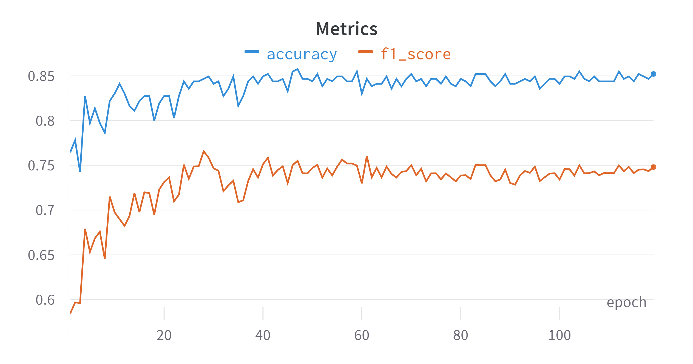
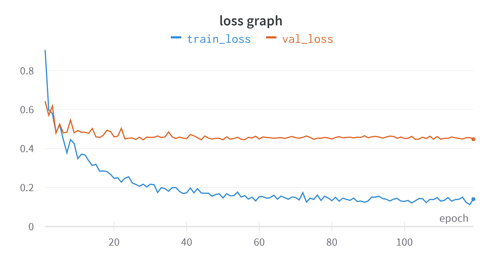

# Plant pathology classifier 🍃
Classify the category of foliar diseases in apple trees
## Stack of technologies 🏗
- Python 🐍
- PyTorch 🔥
- OpenCV 📷
- Albumentations 🖼️
- Wandb 📊
## Task description 📋
For image of apple tree leaf, need to identify the label. There are 4 possible labels: healthy, rust, scab or combinations
## Proposed solution 💡
Efficientnet_b3 was fine-tuned by replacing the head with a custom classifier, the rest of the layers were frozen. 

The model was trained for 120 epochs. Final quality on validation: 
- 0.748 f1 macro score 
- 0.852 accuracy

Quality on validation set during training:

Train and validation loss during training:

## How to improve 🔨
1. More fancy augmentation techniques can be used. I used a simple Horizontal/Vertical flip and RandomBrightnessContrast
2. Behind the scenes, I used a random search on just 2 epochs for hyperparameters optimization. A more complex search algorithm over more iterations is expected to give better results
